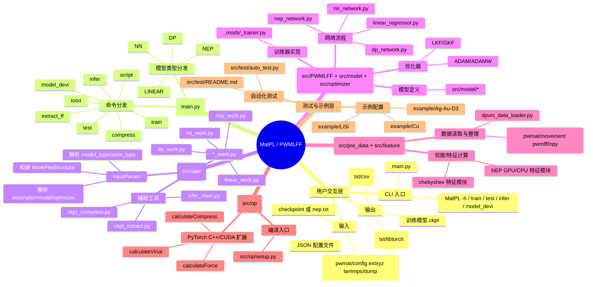
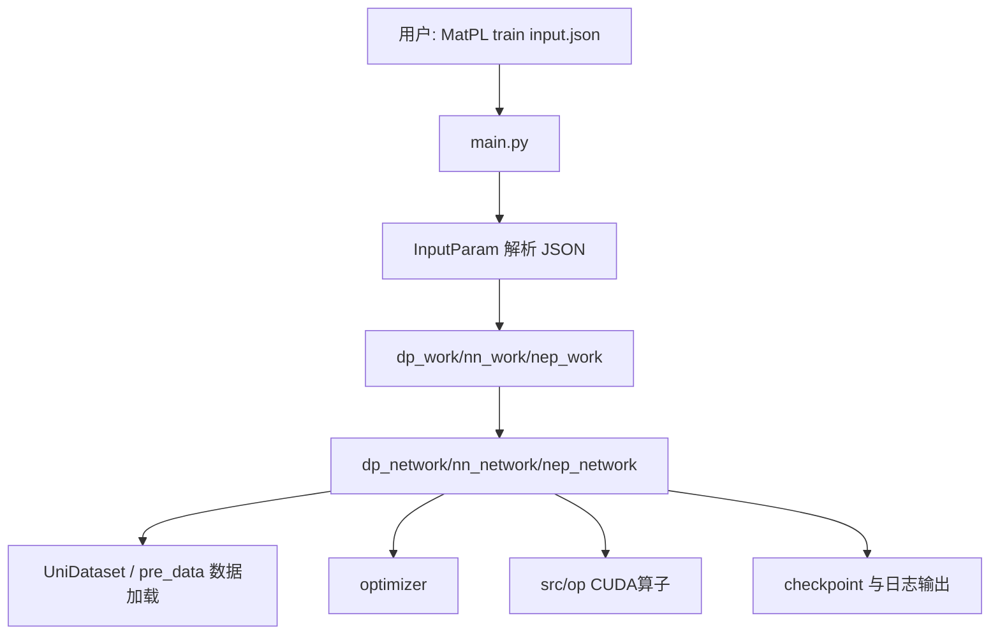

# MatPL 代码结构思维导图

下面提供一个面向新人的「从用户交互到内部模块」的思维导图。

## 1) 整体思维导图（Mermaid）

## 2) 用户交互到调用链（简图）

## 3) 模块关系速记

- `main.py` 是总入口：命令 + 模型类型双分发。
- `src/user` 是编排层：参数抽象、任务流程、模型导出/压缩/推理工具。
- `src/PWMLFF` 是训练推理主线：把数据、模型、优化器串起来。
- `src/model` 和 `src/optimizer` 分别承载模型结构与优化算法。
- `src/pre_data` 和 `src/feature` 负责数据预处理、邻域搜索与特征生成。
- `src/op` 提供 CUDA 扩展算子，是性能关键路径。
- `src/test` + `example` 用于回归验证和新手跑通样例。

## 4) 建议阅读顺序

1. `main.py`（先看入口和命令分发）
2. `src/user/input_param.py`（理解 JSON 字段如何映射到代码对象）
3. `src/user/dp_work.py`（看一条完整 train/test 业务流程）
4. `src/PWMLFF/dp_network.py`（看训练器核心）
5. `src/op/setup.py`（理解高性能算子如何接入）
6. `src/test/auto_test.py` + `example/*`（跑通并做回归）
